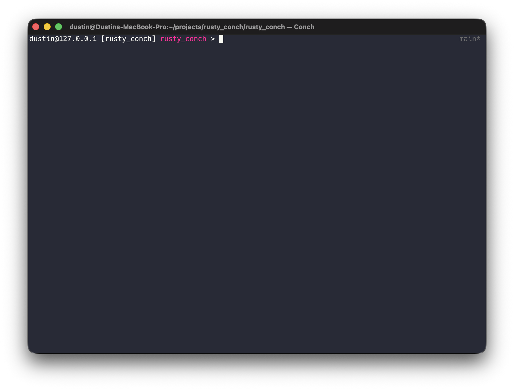
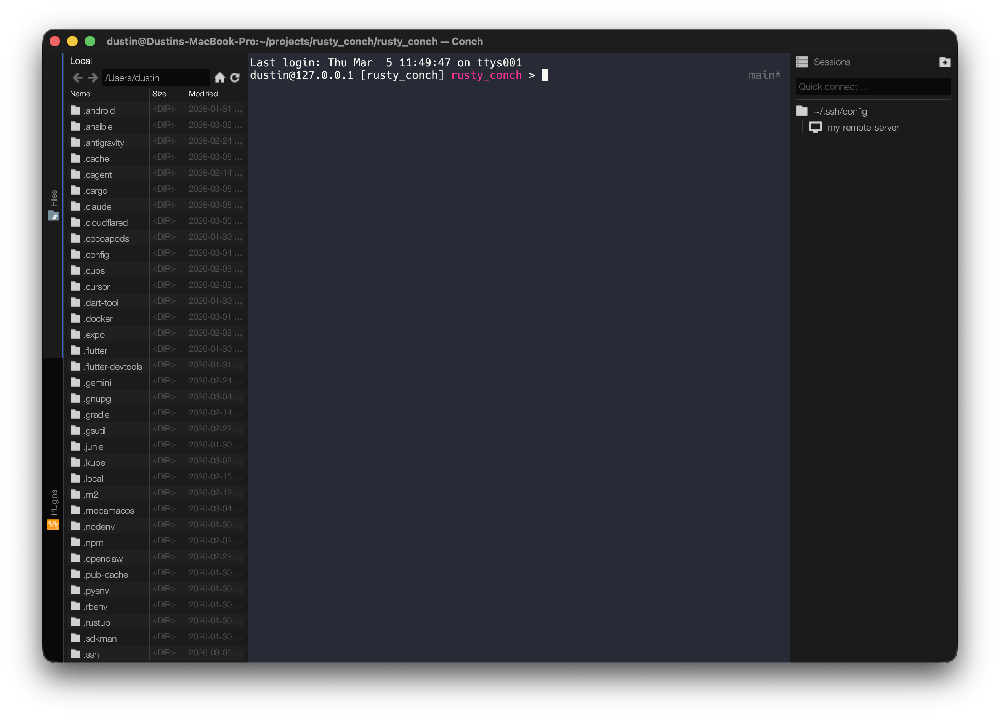

# Conch

A cross-platform terminal emulator with SSH session management, built in Rust with [egui](https://github.com/emilk/egui).

[](https://github.com/an0nn30/rusty_conch/actions/workflows/release.yml)
[](https://github.com/an0nn30/rusty_conch/actions/workflows/release.yml)
[](https://github.com/an0nn30/rusty_conch/actions/workflows/release.yml)
[](https://github.com/an0nn30/rusty_conch/actions/workflows/release.yml)
[](https://github.com/an0nn30/rusty_conch/actions/workflows/release.yml)





## Features

- Local terminal emulation (via alacritty_terminal)
- SSH session management with tabbed interface
- Session sidebar with saved connections
- File browser
- Plugin system
- Cross-platform: macOS, Windows, Linux

## Installation

### From Release

Download the latest release for your platform from the [Releases](https://github.com/an0nn30/rusty_conch/releases) page:

| Platform | Artifact |
|----------|----------|
| macOS (Apple Silicon) | `Conch-x.x.x-macos-arm64.dmg` |
| macOS (Intel) | `Conch-x.x.x-macos-x86_64.dmg` |
| Windows | `Conch-x.x.x-windows-x86_64.zip` |
| Linux (AMD64) | `.deb` / `.rpm` |
| Linux (ARM64) | `.deb` / `.rpm` |

### From Source

Requires Rust 1.85+ (edition 2024).

```bash
git clone https://github.com/an0nn30/rusty_conch.git
cd rusty_conch
cargo build --release -p conch_app
```

#### Linux Dependencies

```bash
sudo apt-get install -y \
  libxcb-render0-dev libxcb-shape0-dev libxcb-xfixes0-dev \
  libxkbcommon-dev libwayland-dev libgtk-3-dev libssl-dev pkg-config
```

## Project Structure

```
crates/
  conch_core/      # Data models, config, crypto (no framework deps)
  conch_session/   # SSH/local session management, PTY, VTE
  conch_plugin/    # Plugin system
  conch_app/       # eframe/egui application
packaging/
  macos/           # Info.plist for .app bundle
  linux/           # .desktop file
```

## License

MIT
