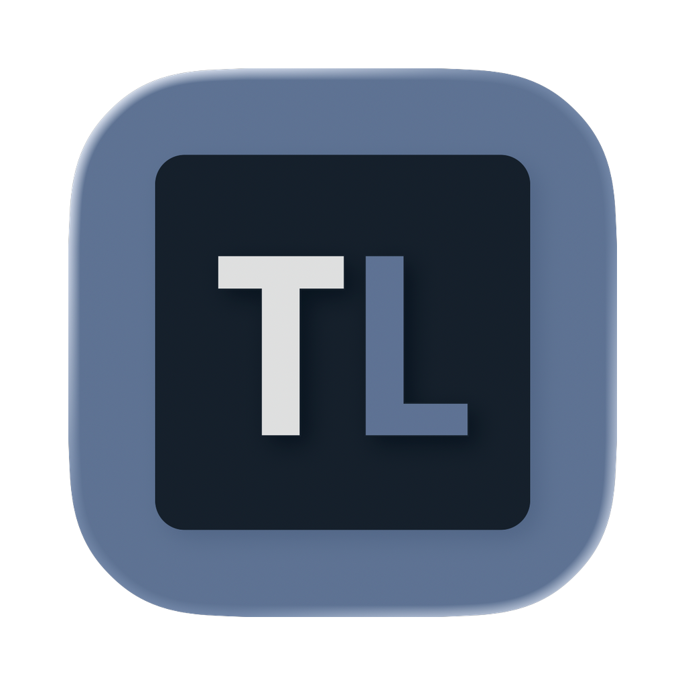

<p align="center">
  
</p>

<h1 align="center">TermLab</h1>

<p align="center">
  A terminal-native workstation that unifies terminal, SSH, files, tunnels, credentials, and plugins in one app.<br/>
  Built with Rust + Tauri + xterm.js. Runs on macOS, Windows, and Linux.
</p>

<p align="center">
  <a href="https://github.com/an0nn30/conch/actions/workflows/ci.yml">
    
  </a>
  <a href="https://github.com/an0nn30/conch/releases">
    
  </a>
  <a href="LICENSE">
    
  </a>
</p>

---

## Why TermLab?

Most terminal emulators do one thing well. SSH clients do another. File transfer tools are often separate. TermLab combines these into a single workstation for terminal-oriented workflows: terminal, SSH sessions, file movement, tunnels, credentials, and extensible tooling.

Positioning: TermLab sits between terminal emulators (iTerm2, WezTerm, Warp) and remote-ops clients (MobaXterm, Termius) as an open-source, cross-platform control plane for terminal-first engineering work.

## Features

**Terminal Core** — Full terminal emulation powered by [xterm.js](https://xtermjs.org/). 256-color, truecolor, mouse reporting, tabs, panes, and multi-window. Configurable font, cursor style, and scroll sensitivity.

**SSH Sessions** (built-in) — Save connections with proxy jump/command support, organized in folders. Password and key authentication. Quick-connect search from the sidebar. Parses `~/.ssh/config` automatically. Host key verification with `~/.ssh/known_hosts`.

**File Explorer** (built-in) — Dual-pane local and remote file browsing. Upload and download with real-time progress tracking via SFTP. Sortable columns, hidden file toggle, navigation history.

**Built-in Editor** — A light [CodeMirror 6](https://codemirror.net/) editor for local and remote files, with syntax highlighting, optional vim keybindings (`[editor] vim_mode`), and Save As to either a local path or an SSH host. Markdown files add a rendered preview — GFM tables, task lists, footnotes, and code fences highlighted with the same grammars the editor uses — in Editor / Split / Preview modes, switched with the buttons in the top-right of the pane, from View > Toggle Markdown Preview, or cycled with `Cmd+Shift+Y`. The preview is offline by design: images are inlined from disk or over the existing SFTP session, no image source ever reaches the preview as a URL — remote ones are stripped and local ones are fetched through TermLab itself — so the preview issues no network requests at all, and the rendered HTML is sanitized and displayed in a sandboxed iframe that cannot execute scripts. Set the mode markdown files open in with `[editor] preview_default_mode`.

**SSH Tunnels** (built-in) — Local port forwarding with persistent tunnel definitions. Start/stop from the sidebar or the tunnel manager dialog.

**Credential Vault** — Encrypted credential storage using AES-256-GCM with Argon2id key derivation. Built-in SSH key generation (Ed25519, ECDSA, RSA), auto-lock timer, and vault-aware SSH connections. Accessible via Tools > Credential Vault.

**Settings Dialog** — Comprehensive settings UI accessible via File > Settings (or `Cmd+,`). Configure appearance, terminal, shell, keyboard shortcuts, plugins, and advanced settings with an Apply/Cancel workflow.

**Auto-Updates** (macOS/Windows) — Checks for new versions on startup and notifies when an update is available. Download and install updates in-place from the app. Configurable via Settings > Advanced or check manually from the menu.

**Theming** — Full [Alacritty-compatible](https://github.com/alacritty/alacritty-theme) `.toml` theme support. Drop a theme file in `~/.config/termlab/themes/` and set `[colors] theme = "name"`. Hot-reload on file change. Live preview in the Settings dialog shows theme colors before applying.

**Zen Mode** — `Cmd+Shift+Z` hides all panels for a distraction-free terminal.

**Lightweight** — No Electron. Tauri webview with a Rust backend. Near-zero idle CPU usage.

## Plugin System

TermLab supports **Lua** and **Java** plugins for extending functionality with custom panels, menu items, notifications, dialogs, and inter-plugin communication.

### What can plugins do?

- **Register sidebar panels** with live-updating declarative widgets (trees, tables, buttons, text inputs, etc.)
- **Communicate with other plugins** via pub/sub events and RPC queries
- **Show dialogs** — forms, confirmations, prompts, alerts
- **Access the clipboard**, show notifications, register menu items with keyboard shortcuts
- **Write to the terminal**, open new tabs
- **Persist configuration** via a per-plugin key-value config store

### Java plugins

TermLab supports **Java plugins** via an embedded JVM. Any JVM language works (Java, Kotlin, Scala, Groovy). The SDK JAR is embedded in the binary — no external files needed. Java plugins have full access to logging, menu items, notifications, clipboard, dialogs (prompt, confirm, alert, forms), config persistence, inter-plugin communication, and terminal/tab control.

See the [Java Plugin SDK](java-sdk/) for the API reference.

### Lua plugins

Lightweight **Lua 5.4 plugins** for quick scripting. Drop a `.lua` file in your plugins directory and enable it via Settings > Plugins.

```lua
-- plugin-name: Hello World
-- plugin-description: A simple action plugin
-- plugin-type: action
-- plugin-version: 1.0.0

function setup()
    app.log("info", "Hello from a plugin!")
    app.register_menu_item("Tools", "Say Hello", "say_hello")
end

function on_event(event)
    if type(event) == "table" and event.action == "say_hello" then
        app.notify("Hello", "Hello from a plugin!", "success")
    end
end
```

### Plugin management

Plugins are managed via **Settings > Plugins**:
- Scans all configured search paths for `.lua` and `.jar` plugins
- Enable/disable plugins with a single click
- Enabled plugins are remembered across restarts
- Plugin menu items appear in the native Tools menu

### Plugin development

See the **[VS Code extension](editors/vscode/)** or **[Neovim definitions](editors/neovim/)** for Lua API completions and hover docs.

## Installation

### Pre-built binaries

Download the latest release for your platform from the [Releases page](https://github.com/an0nn30/conch/releases).

**Windows:** grab `TermLab_<version>_x64-setup.exe` (or the `.msi`). CI only
builds x64; native ARM64 builds aren't available yet, and running the x64
setup.exe under Windows on ARM emulation hasn't been tested. The setup.exe is
per-user and needs no administrator prompt — it installs to
`%LOCALAPPDATA%\TermLab`. The MSI has no such scope override and installs
per-machine instead: expect a UAC prompt, and its uninstall entry lives under
`HKLM\WOW6432Node`, not per-user.

The installer registers TermLab with Windows:

- **"Open TermLab here"** in the Explorer context menu, for folders, folder
  backgrounds, and drives.
- **Settings > Default apps**, so TermLab appears alongside other terminals.
- **`Win+R` → `termlab`**, via an App Paths entry.

Uninstalling removes all of these.

Three current limitations:

- On Windows 11 the context-menu entry is under **"Show more options"**
  (or `Shift`+`F10`), not the top-level menu. A top-level entry requires a
  signed sparse MSIX package with an `IExplorerCommand` handler, which
  TermLab does not ship yet.
- TermLab does not appear in Windows 11's **"Default terminal application"**
  dropdown. That setting requires implementing ConPTY handoff
  (`ITerminalHandoff3`), which is separate from the default-app registration
  above.
- An MSI-installed TermLab shows no icon next to its entry in Add/Remove
  Programs (the setup.exe's entry does), since Tauri's WiX template doesn't
  set an `ARPPRODUCTICON`.

One filename quirk: at a pre-release version like the current `3.0.0-rc.2`,
the MSI can't carry the `-rc.2` suffix — Windows Installer requires
`ProductVersion` to be numeric-only — so the MSI ships named with the plain
`3.0.0` while the setup.exe keeps the full `3.0.0-rc.2`. That mismatch is
expected, not a packaging bug.

### Build from source

#### Toolchain (all platforms)

- Rust `1.85+` (edition 2024)
- `cargo`
- JDK `17+` (required for Java plugin support; recommended for all builds)

#### Platform requirements

#### macOS

- Xcode Command Line Tools:
  - `xcode-select --install`
- Rust target/toolchain installed via `rustup`

#### Linux (Debian/Ubuntu)

```bash
sudo apt-get update
sudo apt-get install -y \
  build-essential pkg-config libssl-dev \
  libgtk-3-dev libwebkit2gtk-4.1-dev \
  libayatana-appindicator3-dev librsvg2-dev
```

#### Linux (Fedora)

```bash
sudo dnf install -y \
  gcc gcc-c++ make pkgconf-pkg-config openssl-devel \
  gtk3-devel webkit2gtk4.1-devel \
  libappindicator-gtk3-devel librsvg2-devel
```

#### Linux (Arch)

```bash
sudo pacman -S --needed \
  base-devel pkgconf openssl \
  gtk3 webkit2gtk-4.1 libappindicator-gtk3 librsvg
```

#### Windows

- Microsoft C++ Build Tools (MSVC) or Visual Studio with C++ workload
- WebView2 Runtime (usually already installed on Windows 10/11)
- JDK `17+`
- Rust MSVC toolchain (`rustup default stable-x86_64-pc-windows-msvc`)

```bash
git clone https://github.com/an0nn30/conch.git
cd termlab

# Debug build / run
cargo run -p termlab_tauri

# Release build
cargo build --release -p termlab_tauri
```

The binary is at `target/release/termlab`.

To build the installer artifacts (the setup.exe and MSI, with the Explorer
context menu and other Windows registration baked in), run the same script
CI uses:

```powershell
powershell -ExecutionPolicy Bypass -File scripts\build-windows.ps1
```

`-ExecutionPolicy Bypass` is needed because a freshly provisioned Windows
machine defaults to the `Restricted` execution policy, which refuses to load
any `.ps1` file at all, signed or not; the flag overrides that for this one
process only and changes no persistent system setting. That's the
PowerShell 5.1 invocation, which works out of the box on stock Windows
10/11; use `pwsh -ExecutionPolicy Bypass -File scripts/build-windows.ps1`
instead if you have PowerShell 7 installed. Either way it produces the
setup.exe and MSI under `target\release\bundle\`, built by the same script
and from the same registration sources CI uses. It isn't byte-identical to
a CI release build, though: without a signing key configured locally there's
no `.sig` update-manifest signature, and the artifacts are built for
whatever architecture the local machine is (CI only produces x64). To verify
an installer actually registers (and cleans up) correctly:

```powershell
powershell -ExecutionPolicy Bypass -File scripts\tests\verify-windows-install.ps1
```

## Keyboard Shortcuts

> On Linux/Windows, replace `Cmd` with `Ctrl`.

| Shortcut | Action |
|----------|--------|
| `Cmd+,` | Settings |
| `Cmd+T` | New tab |
| `Cmd+W` | Close tab |
| `Cmd+1`--`9` | Switch to tab N |
| `Cmd+Shift+N` | New window |
| `Cmd+Shift+E` | Toggle left panel |
| `Cmd+Shift+R` | Toggle right panel |
| `Cmd+Shift+J` | Toggle bottom panel |
| `Cmd+Shift+Z` | Zen mode (hide all panels) |
| `Cmd+/` | Toggle & focus quick connect |
| `Cmd+=` / `Cmd+-` / `Cmd+0` | Zoom in / out / reset |
| `Cmd+Shift+T` | Manage SSH tunnels |
| `Cmd+Shift+Y` | Toggle markdown preview (editor / split / preview) |

All shortcuts are configurable in `[termlab.keyboard]`. Plugins can also register their own keybindings.

## Configuration

Most settings can be configured through the Settings dialog (File > Settings or `Cmd+,`). For manual editing, TermLab uses a TOML config at `~/.config/termlab/config.toml` (Linux/macOS) or `%APPDATA%\termlab\config.toml` (Windows).

Alacritty-compatible sections (`[window]`, `[font]`, `[colors]`, `[terminal]`) work as-is. TermLab adds its own sections:

```toml
[colors]
theme = "auto"              # "auto" follows the app appearance; or any Alacritty .toml theme file name

[termlab]
check_for_updates = true    # Check for new versions on startup (macOS/Windows)

[termlab.keyboard]
new_tab = "cmd+t"
close_tab = "cmd+w"
new_window = "cmd+shift+n"
quit = "cmd+q"
rename_tab = "f2"
zen_mode = "cmd+shift+z"
toggle_left_panel = "cmd+shift+e"
toggle_right_panel = "cmd+shift+r"
toggle_bottom_panel = "cmd+shift+j"
split_vertical = "cmd+d"
split_horizontal = "cmd+shift+d"
close_pane = "cmd+shift+w"
navigate_pane_up = "cmd+alt+up"
navigate_pane_down = "cmd+alt+down"
navigate_pane_left = "cmd+alt+left"
navigate_pane_right = "cmd+alt+right"

[termlab.keyboard.plugin_shortcuts]
"My Plugin:do_thing" = "ctrl+alt+4"  # Per-plugin override key: "<plugin>:<action>"

[termlab.plugins]
enabled = true              # Master switch
lua = true                  # Lua plugins
java = true                 # Java plugins (disabling skips JVM startup)
search_paths = []           # Additional plugin discovery directories
```

See [`config.example.toml`](config.example.toml) for the full reference.

## Project Structure

```
crates/
  termlab_core/         Config loading, color schemes, persistent state
  termlab_plugin_sdk/   Widget/event types shared with Lua and Java plugins
  termlab_plugin/       Plugin host — message bus, Lua runner, Java runtime
  termlab_remote/       Platform-agnostic SSH, SFTP, tunnels (russh)
  termlab_tauri/        The app — Tauri/xterm.js UI, built-in SSH/SFTP/tunnels
  termlab_vault/        Credential vault — encrypted storage, key generation
java-sdk/             Java Plugin SDK (JAR + sources)
editors/
  vscode/             VS Code extension for Lua plugin development
  neovim/             Neovim/LuaLS type definitions for Lua plugin development
```

## Contributing

TermLab is actively developed. Bug reports, feature requests, and pull requests are welcome — please [open an issue](https://github.com/an0nn30/conch/issues) to start a discussion. When submitting PRs, use branch prefixes: `feat/`, `fix/`, `chore/`, or `perf/`.

For plugin development, see the [Java Plugin SDK](java-sdk/) and the editor extensions in [editors/](editors/).

## License

[Apache 2.0](LICENSE)
